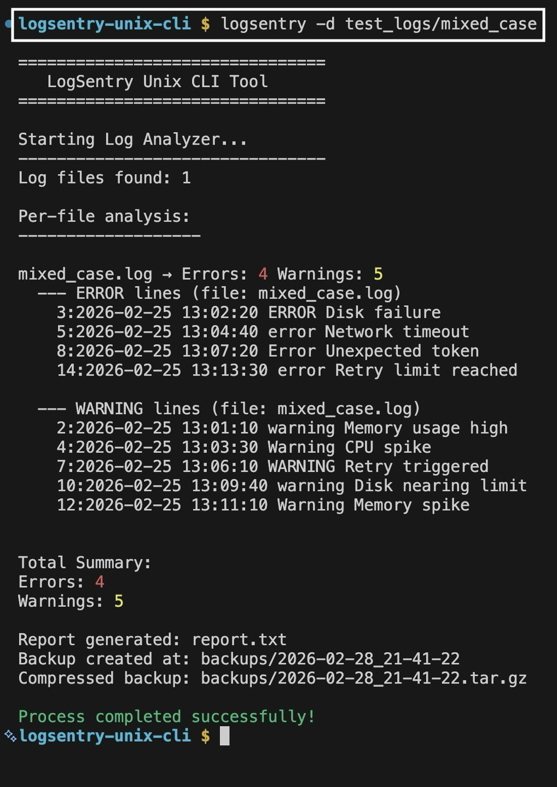
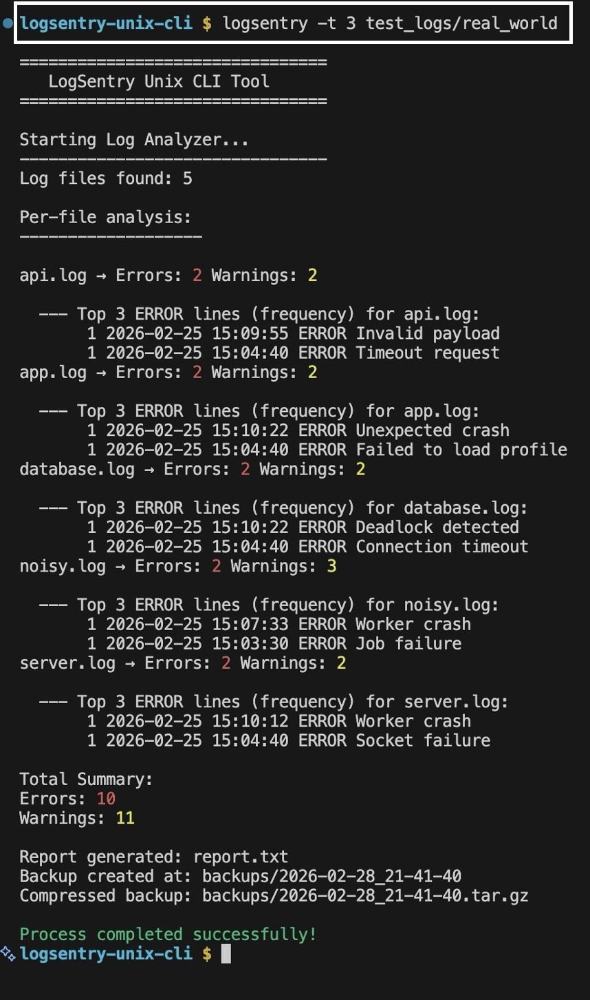
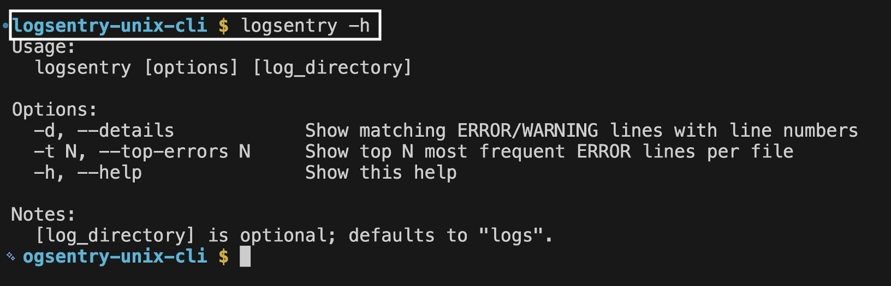

<p align="center">
  <h1 align="center">LogSentry Unix CLI</h1>
  <p align="center">
    A reusable Bash CLI for multi-service log analysis, reporting, and automated backups.
  </p>
</p>

---

## Installation

```bash
chmod +x install.sh
./install.sh
```

Run from anywhere after install:

```bash
logsentry
logsentry /path/to/logs
```

## Usage:

```bash
logsentry test_logs/real_world
```

## Quick options:

```bash
logsentry -h                          # show help
logsentry -d test_logs/mixed_case     # show matching ERROR/WARNING lines with line numbers
logsentry -t 3 test_logs/real_world   # show top 3 most frequent ERROR lines per file
```

## Features

- Per-file log analysis with case-insensitive detection of ERROR and WARNING.
- Per-log insights (counts per file) for faster debugging.
    -d / --details: show matching ERROR/WARNING lines with line numbers.
    -t N / --top-errors N: show top N most frequent ERROR lines per file.
    -h / --help: compact usage & flags.
- Aggregated summary reporting across multi-service log directories.
- Timestamped report generation for audit-friendly traceability.
- Automated backup snapshots with .tar.gz compression.
- Graceful failure handling for empty or invalid log directories.
- Colorized output for Errors (red), Warnings (yellow), and Success (green).
- Structured test suite covering isolated and production-like scenarios.


## Tech Stack

- Bash
- Unix CLI tools (grep, wc, tar, cp, sed, sort, uniq)
- Git


## Screenshots

<table>
  <tr>
    <td align="center"><b>Run Output (summary)</b></td>
    <td align="center"><b>Run Output (details: -d)</b></td>
    <td align="center"><b>Run Output (top errors: -t 3)</b></td>
  </tr>
  <tr>
    <td align="center">
      
    </td>
    <td align="center">
      
    </td>
    <td align="center">
      
    </td>
  </tr>

  <tr>
    <td align="center"><b>Generated Report</b></td>
    <td align="center"><b></b>Backup Artifacts (backups/)</td>
    <td align="center"><b>Project Structure</b></td>
  </tr>
  <tr>
    <td align="center">
      
    </td>
    <td align="center">
      
    </td>
    <td align="center">
      
    </td>
  </tr>

  <tr>
    <td colspan="3" align="center">
      <b>Help / Flags</b>
    </td>
  </tr>
  <tr>
    <td colspan="3" align="center">
      
    </td>
  </tr>
</table>

---

## Testing

This project includes an automated test runner and structured test fixtures to validate behavior across isolated and real-world scenarios.

### Run full test suite

```bash
chmod +x run_tests.sh
./run_tests.sh
```

Scenarios included:

- test_logs/clean — clean logs (no errors)
- test_logs/errors — error-heavy logs
- test_logs/warnings — warning-heavy logs (if present)
- test_logs/malformed — noisy / malformed logs
- test_logs/real_world — combined production-like dataset
- test_logs/empty — empty directory (graceful failure)

You can also test specific datasets (examples):
```bash
logsentry test_logs/malformed
logsentry -d test_logs/real_world
logsentry -t 5 test_logs/mixed_case
```

What the tests validate:
- Correct aggregation of ERROR and WARNING entries (case-insensitive)
- Robust handling of malformed or noisy log entries
- Graceful exit when no .log files are found
- Automatic report generation (report.txt)
- Timestamped backup creation and compression (backups/)