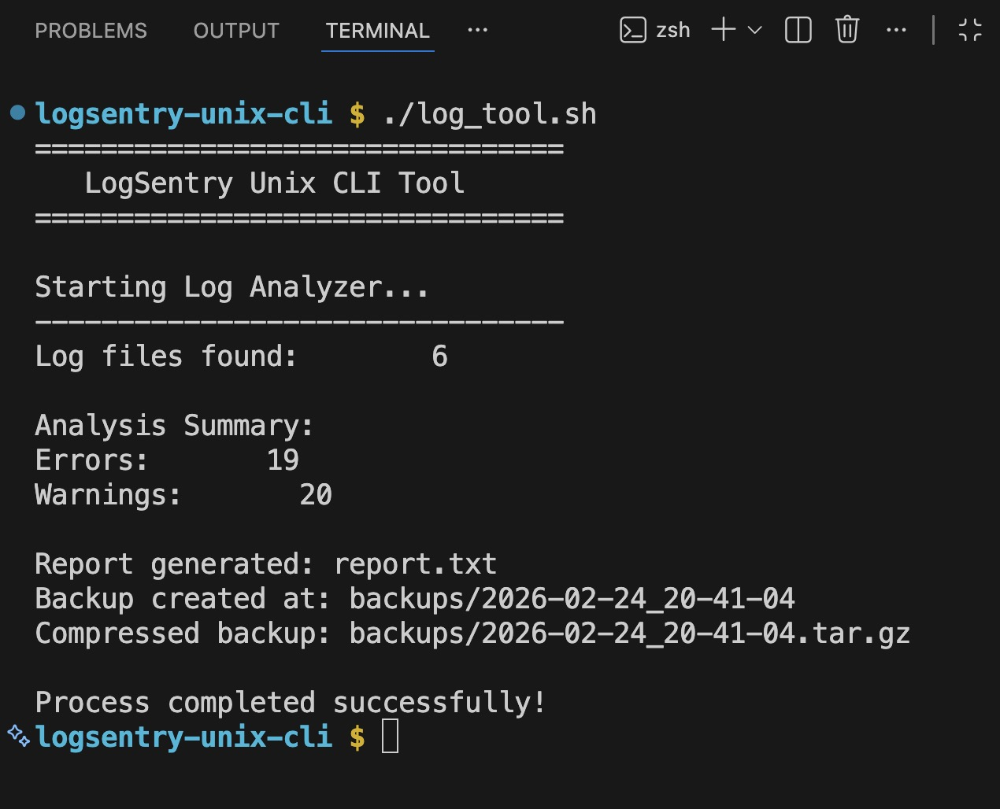
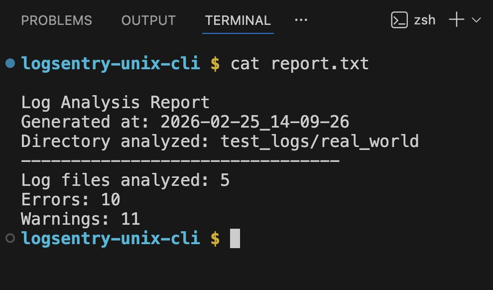
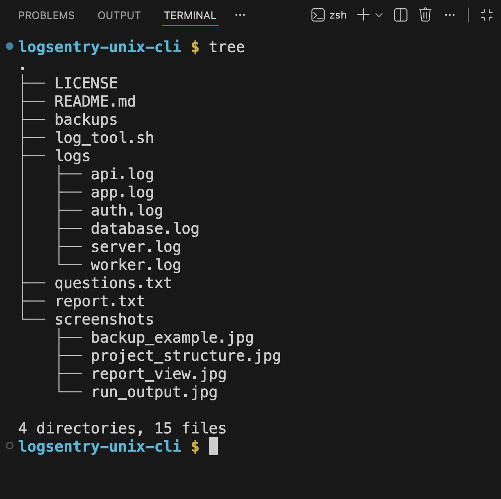
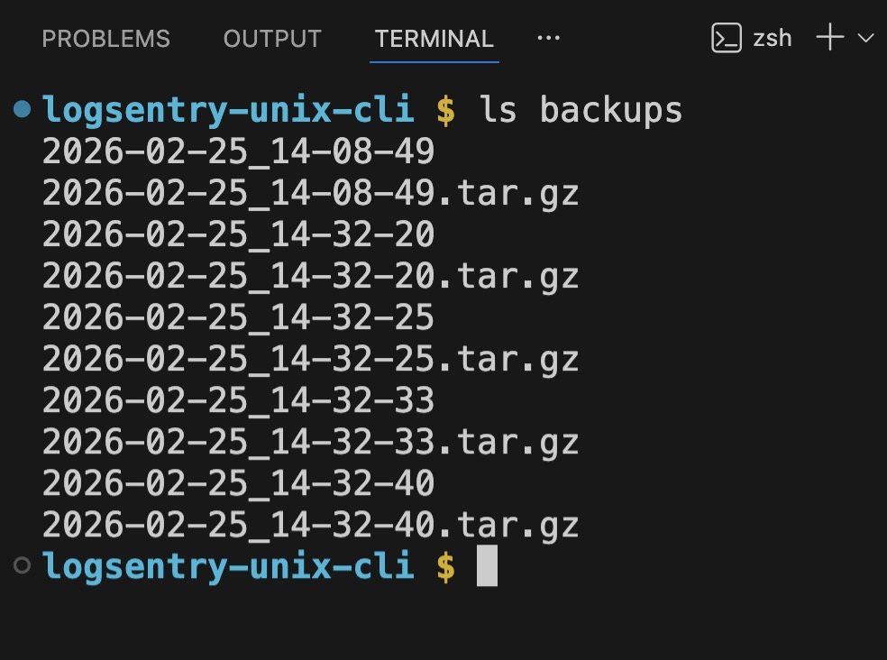

<p align="center">
  <h1 align="center">LogSentry Unix CLI</h1>
  <p align="center">
    A reusable Bash CLI for multi-service log analysis, reporting, and automated backups.
  </p>
</p>

---

## Installation

```bash
chmod +x install.sh
./install.sh
```

Run from anywhere:

```bash
logsentry
logsentry /path/to/logs
```

## Usage:

```bash
logsentry test_logs/real_world
```


## Features

- Per-file log analysis with case-insensitive detection of ERROR and WARNING
- Aggregated summary reporting across multi-service log directories
- Timestamped report generation for audit-friendly traceability
- Automated backup snapshots with .tar.gz compression
- Directory-based execution (analyze any folder containing .log files)
- Graceful failure handling for empty or invalid log directories
- Structured test suite covering isolated and production-like scenarios


## Tech Stack

- Bash
- Unix CLI tools (grep, wc, tar, cp)
- macOS Unix environment


## Screenshots

<table>
  <tr>
    <td align="center"><b>CLI Execution</b></td>
    <td align="center"><b>Generated Report</b></td>
  </tr>
  <tr>
    <td>
      
    </td>
    <td>
      
    </td>
  </tr>
  <tr>
    <td align="center"><b>Project Structure</b></td>
    <td align="center"><b>Backup Snapshots</b></td>
  </tr>
  <tr>
    <td>
      
    </td>
    <td>
      
    </td>
  </tr>
</table>

---

## Testing

This project includes an automated test runner and structured test fixtures to validate behavior across isolated and real-world scenarios.

### Run full test suite

```bash
chmod +x run_tests.sh
./run_tests.sh
```

Scenarios covered:

- test_logs/clean — clean logs (no errors)
- test_logs/errors — error-heavy logs
- test_logs/warnings — warning-heavy logs (if present)
- test_logs/malformed — noisy / malformed logs
- test_logs/real_world — combined production-like dataset
- test_logs/empty — empty directory (graceful failure)

Run manually
```bash
logsentry test_logs/real_world
logsentry /path/to/your/logs
```

## Validation checks
- Correct aggregation of ERROR and WARNING entries (case-insensitive)
- Robust handling of malformed or noisy log entries
- Graceful exit when no log files are found
- Automatic report generation (report.txt)
- Timestamped backup creation and compression (backups/)

---