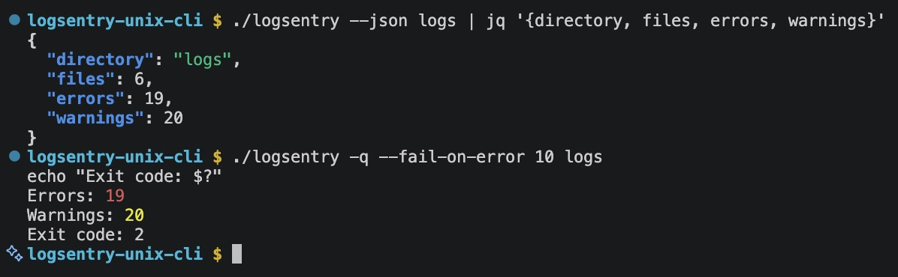

<p align="center">
  <h1 align="center">LogSentry</h1>
  <p align="center">Triage a directory of logs in one command.</p>
  <p align="center">
    <a href="https://github.com/dhananjay2403/logsentry-unix-cli/actions/workflows/ci.yml">
      
    </a>
    
    
    
  </p>
</p>

<table>
  <tr>
    <td align="center"><b>Analysis</b></td>
    <td align="center"><b>Ranked errors (<code>-t 3</code>)</b></td>
  </tr>
  <tr>
    <td align="center"></td>
    <td align="center"></td>
  </tr>
  <tr>
    <td align="center"><b>Generated report</b></td>
    <td align="center"><b>JSON output & CI</b></td>
  </tr>
  <tr>
    <td align="center"></td>
    <td align="center"></td>
  </tr>
</table>

Point it at a directory of logs: it reports how many errors and warnings each file has, ranks the
errors that repeat, and archives what it analysed. One Bash script, no dependencies beyond standard
Unix tools.

## Install

```bash
git clone https://github.com/dhananjay2403/logsentry-unix-cli.git
cd logsentry-unix-cli
./install.sh                         # /usr/local/bin (uses sudo if needed)
PREFIX="$HOME/.local" ./install.sh   # user-local, no sudo
```

Uninstall with `./uninstall.sh`, passing the same `PREFIX`. Or use Docker:

```bash
docker pull dhananjaytiwari/logsentry:1.4     # or :latest
```

## Features

- **Per-file + aggregate counts** — `-d` for matching lines, `-t N` for top errors.
- **Whole-word levels** — counts `WARN` and `FATAL`, ignores `error_rate=0`.
- **Single-pass awk** — each file read once, whatever flags you use.
- **CI-ready** — `--json` output, `--fail-on-error N` exits `2`.
- **Nested + rotated logs** — `-r` and `--pattern '*.log*'`.
- **Backups** — timestamped `.tar.gz`, `umask 077`, `--keep N` retention.
- **Portable** — macOS bash 3.2, Linux, Alpine busybox; all verified in CI.

## Benchmarks

<!-- BENCHMARK SUMMARY START -->

Measured with `./scripts/benchmark.sh --full` on Apple M2 (Darwin arm64, bash 3.2.57).

### Performance summary

| Metric | Measured |
|---|---|
| Throughput (5M-line benchmark) | 445,632 lines/s |
| Peak memory | 3.7 MB |
| Docker image | 20.5MB |
| Docker image reduction | 81% smaller than the previous `ubuntu:22.04` image |
| Compression ratio | 90% (278.9 MB of logs to 25.9 MB) |
| Automated tests | 65 / 65 passing |
| ShellCheck | zero warnings (`-S style`) |

### Scaling

| Lines | Corpus size | Median time | Throughput | Peak memory |
|---|---|---|---|---|
| 100,000 | 5.4 MB | 0.29s | 344,827 lines/s | 3.6 MB |
| 1,000,000 | 55.1 MB | 2.49s | 401,606 lines/s | 3.6 MB |
| 5,000,000 | 278.9 MB | 11.22s | 445,632 lines/s | 3.7 MB |

_Median of 5 runs per size after a discarded warm-up, end to end (analysis, report,
archive). Memory stays flat as the corpus grows because the engine streams with awk.
Method and caveats: [docs/BENCHMARKS.md](docs/BENCHMARKS.md)._
<!-- BENCHMARK SUMMARY END -->

## Usage

```bash
logsentry                        # analyse ./logs
logsentry /var/log/myapp         # analyse any directory
logsentry --help

# Matching lines with line numbers, and the three most frequent errors per file
logsentry -d /var/log/myapp
logsentry -t 3 /var/log/myapp

# Nested directories and rotated files
logsentry -r --pattern '*.log*' /var/log/myapp

# Machine-readable output
logsentry --json /var/log/myapp | jq '.errors'
logsentry --json /var/log/myapp | jq -r '.results[] | "\(.file) \(.errors)"'

# Fail a CI job when errors reach a threshold
logsentry -q --fail-on-error 10 /var/log/myapp || echo "error budget exceeded"

# Keep only the five newest backup archives
logsentry --keep 5 /var/log/myapp
```

### Options

| Option | Description |
|---|---|
| `-d`, `--details` | Show matching ERROR/WARNING lines with line numbers |
| `-t N`, `--top-errors N` | Show the N most frequent ERROR lines per file |
| `-r`, `--recursive` | Search sub-directories too |
| `--pattern GLOB` | Which files to analyse (default: `*.log`) |
| `--json` | Print a JSON summary instead of the human report |
| `-q`, `--quiet` | Print only the totals |
| `--no-color` | Disable coloured output (also honours `NO_COLOR`) |
| `--keep N` | Keep only the N newest backup archives |
| `--fail-on-error N` | Exit with status `2` when errors reach N |
| `-V`, `--version` | Print the version |
| `-h`, `--help` | Show help |

### Environment

| Variable | Default | Purpose |
|---|---|---|
| `LOG_DIR` | `logs` | Directory to analyse when no argument is given |
| `REPORT_DIR` | `reports` | Where the summary report is written |
| `BACKUP_ROOT` | `backups` | Where `.tar.gz` backup archives are written |
| `NO_COLOR` | unset | Set to any value to disable coloured output |

### Exit status

| Code | Meaning |
|---|---|
| `0` | Analysis completed |
| `1` | Usage error, missing directory, or no matching files found |
| `2` | Errors reached the `--fail-on-error` threshold |

Exit codes are a CLI's API — they are what let the tool compose with `&&`, `||`, and CI.

## Docker

```bash
docker run --rm --user "$(id -u):$(id -g)" \
  -v "$(pwd)/host_logs:/data/logs" \
  -v "$(pwd)/host_reports:/data/reports" \
  -v "$(pwd)/host_backups:/data/backups" \
  dhananjaytiwari/logsentry:1.4
```

The image is Alpine-based and runs as a non-root user, so `--user` keeps the generated reports and
archives owned by you.

## Testing

```bash
./tests/test_logsentry.sh
shellcheck -S style logsentry install.sh uninstall.sh scripts/*.sh tests/*.sh
```

[CI](.github/workflows/ci.yml) runs both on every push, plus a Docker build whose container output
is diffed against the host run — that is what proves the POSIX awk engine behaves identically under
busybox awk.

## License

[MIT](LICENSE)
