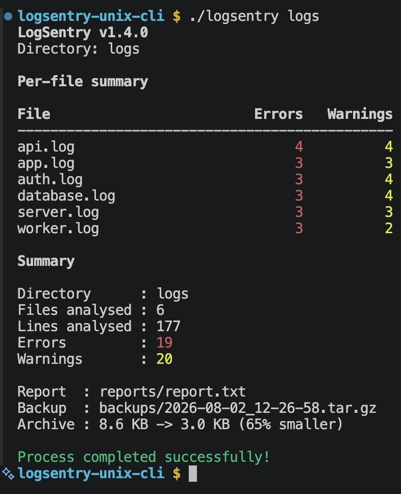
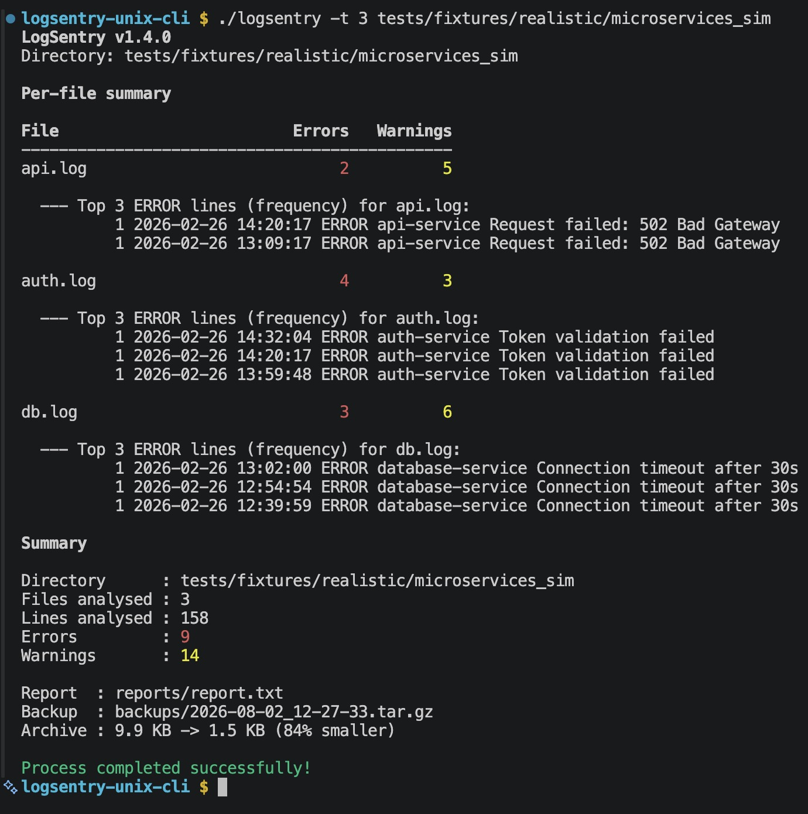
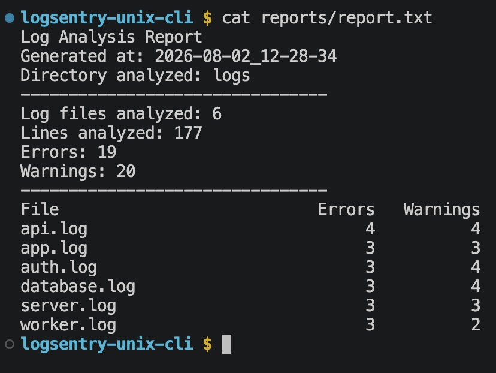

<p align="center">
  <h1 align="center">LogSentry</h1>
  <p align="center">
    A single-file Bash CLI for triaging directories of log files:
    per-file ERROR/WARNING counts, ranked errors, JSON output, and compressed backups.
  </p>
  <p align="center">
    <a href="https://github.com/dhananjay2403/logsentry-unix-cli/actions/workflows/ci.yml">
      
    </a>
    
    
    
  </p>
</p>

---

## Overview

Point LogSentry at a directory of logs and it tells you how many errors and warnings each file
has, which errors repeat most, and writes a timestamped compressed archive of the logs it analysed.

It is one Bash script with no dependencies beyond standard Unix tools, so it installs by copying
a single file and runs the same way on macOS (stock bash 3.2), Linux, and inside a small Alpine
container. Log levels are matched as whole words, so `error_rate=0` is not counted as an error
and `WARN` is not missed. `--json` and threshold exit codes make it usable from a CI pipeline.

## Features

- Per-file and aggregate ERROR/WARNING counts, with `-d` for matching lines and `-t N` for the
  most frequent errors.
- Whole-word level matching: `ERROR`, `ERR`, `FATAL`, `CRITICAL`, `WARN`, `WARNING` count;
  `error_rate=0`, `ErrorHandler` and `0 errors found` do not.
- Single-pass POSIX `awk` engine — each file is read once regardless of which flags are used.
- `--json` output for pipelines, `--fail-on-error N` (exit `2`) to gate CI.
- Recursive search and custom globs for nested and rotated logs (`-r`, `--pattern`).
- Timestamped `.tar.gz` backups created under `umask 077`, with `--keep N` retention.
- Reports with a per-file breakdown, written to a configurable directory.
- Colour that disables itself when redirected, plus `--no-color` and `NO_COLOR`.

## Installation

```bash
git clone https://github.com/dhananjay2403/logsentry-unix-cli.git
cd logsentry-unix-cli
./install.sh                         # /usr/local/bin (uses sudo if needed)
PREFIX="$HOME/.local" ./install.sh   # user-local, no sudo
```

Uninstall with `./uninstall.sh` (pass the same `PREFIX` you installed with).

Or build the Docker image locally:

```bash
docker build -t logsentry:1.5 .
```

> **Not published yet.** A Homebrew tap (`brew install dhananjay2403/tap/logsentry`) and a
> pre-built Docker Hub image for this version are prepared but not released — the formula and
> the release steps live in [`packaging/`](packaging/). The published Docker Hub tag
> (`dhananjaytiwari/logsentry:1.3`) predates the Alpine image and the current engine, so build
> locally instead until 1.5 is pushed.

## Quick start

```bash
logsentry                    # analyse ./logs
logsentry /var/log/myapp     # analyse any directory
logsentry --help
```

## Examples

```bash
# Show the matching ERROR/WARNING lines with line numbers
logsentry -d /var/log/myapp

# Rank the three most frequent errors in each file
logsentry -t 3 /var/log/myapp

# Nested directories and rotated files
logsentry -r --pattern '*.log*' /var/log/myapp

# Machine-readable output
logsentry --json /var/log/myapp | jq '.errors'
logsentry --json /var/log/myapp | jq -r '.results[] | "\(.file) \(.errors)"'

# Fail a CI job when errors reach a threshold
logsentry -q --fail-on-error 10 /var/log/myapp || echo "error budget exceeded"

# Keep only the five newest backup archives
logsentry --keep 5 /var/log/myapp
```

## CLI options

| Option | Description |
|---|---|
| `-d`, `--details` | Show matching ERROR/WARNING lines with line numbers |
| `-t N`, `--top-errors N` | Show the N most frequent ERROR lines per file |
| `-r`, `--recursive` | Search sub-directories too |
| `--pattern GLOB` | Which files to analyse (default: `*.log`) |
| `--json` | Print a JSON summary instead of the human report |
| `-q`, `--quiet` | Print only the totals |
| `--no-color` | Disable coloured output (also honours `NO_COLOR`) |
| `--keep N` | Keep only the N newest backup archives |
| `--fail-on-error N` | Exit with status `2` when errors reach N |
| `-V`, `--version` | Print the version |
| `-h`, `--help` | Show help |

### Environment variables

| Variable | Default | Purpose |
|---|---|---|
| `LOG_DIR` | `logs` | Directory to analyse when no argument is given |
| `REPORT_DIR` | `reports` | Where the summary report is written |
| `BACKUP_ROOT` | `backups` | Where `.tar.gz` backup archives are written |
| `NO_COLOR` | unset | Set to any value to disable coloured output |

### Exit status

| Code | Meaning |
|---|---|
| `0` | Analysis completed |
| `1` | Usage error, missing directory, or no matching files found |
| `2` | Errors reached the `--fail-on-error` threshold |

Exit codes are a CLI's API — they are what let the tool compose with `&&`, `||`, and CI.

## Docker usage

```bash
docker build -t logsentry:1.5 .
mkdir -p host_logs host_reports host_backups
cp logs/*.log host_logs/

docker run --rm --user "$(id -u):$(id -g)" \
  -v "$(pwd)/host_logs:/data/logs" \
  -v "$(pwd)/host_reports:/data/reports" \
  -v "$(pwd)/host_backups:/data/backups" \
  logsentry:1.5
```

Reports and archives persist on the host through the bind mounts. The image is Alpine-based and
runs as a non-root user, so `--user "$(id -u):$(id -g)"` keeps generated files owned by you.
Alpine ships **busybox awk**, which is why the engine is written in POSIX awk — CI verifies that
the container and the host produce identical counts.

## Benchmarks

<!-- BENCHMARK SUMMARY START -->

Measured with `./scripts/benchmark.sh --full` on Apple M2 (Darwin arm64, bash 3.2.57).

### Performance summary

| Metric | Measured |
|---|---|
| Throughput (5M-line benchmark) | 445,632 lines/s |
| Peak memory | 3.7 MB |
| Docker image | 20.5MB |
| Docker image reduction | 81% smaller than the previous `ubuntu:22.04` image |
| Compression ratio | 90% (278.9 MB of logs to 25.9 MB) |
| Automated tests | 64 / 64 passing |
| ShellCheck | zero warnings (`-S style`) |

### Scaling

| Lines | Corpus size | Median time | Throughput | Peak memory |
|---|---|---|---|---|
| 100,000 | 5.4 MB | 0.29s | 344,827 lines/s | 3.6 MB |
| 1,000,000 | 55.1 MB | 2.49s | 401,606 lines/s | 3.6 MB |
| 5,000,000 | 278.9 MB | 11.22s | 445,632 lines/s | 3.7 MB |

_Median of 5 runs per size after a discarded warm-up, end to end (analysis, report,
archive). Memory stays flat as the corpus grows because the engine streams with awk.
Method and caveats: [docs/BENCHMARKS.md](docs/BENCHMARKS.md)._
<!-- BENCHMARK SUMMARY END -->

## Screenshots

<table>
  <tr>
    <td align="center"><b>Run output</b></td>
    <td align="center"><b>Top errors (<code>-t 3</code>)</b></td>
    <td align="center"><b>Generated report</b></td>
  </tr>
  <tr>
    <td align="center"></td>
    <td align="center"></td>
    <td align="center"></td>
  </tr>
</table>

A terminal recording shows the CLI in use better than screenshots do —
see [docs/demo.md](docs/demo.md) for how it is recorded.

## Development

```
logsentry              the CLI (one file, no build step)
install.sh             installer, honours PREFIX
scripts/               developer tooling: log generators and benchmarks
tests/                 test runner and fixtures
docs/                  benchmark method and demo recording notes
logs/                  example dataset, the default input directory
```

The script targets **bash 3.2** so it runs on stock macOS without Homebrew: no associative
arrays, no `mapfile`, no `${var,,}`. All `awk` is POSIX so the same code runs under BSD awk,
gawk, mawk and busybox awk.

## Testing

```bash
./tests/test_logsentry.sh
shellcheck -S style logsentry install.sh uninstall.sh scripts/*.sh tests/*.sh
```

The suite is plain Bash — no framework to install — and every case asserts a real value, so it
fails when behaviour regresses. It writes reports and archives to a temporary directory, never
into the repository. Fixtures live in `tests/fixtures/`, including `tricky/` (`error_rate=0`,
`WARN`, `FATAL`) which locks in whole-word level matching, and `nested/` for `-r` and `--pattern`.

[CI](.github/workflows/ci.yml) runs on every push: ShellCheck, the test suite on Ubuntu and
macOS, and a Docker build whose container output is diffed against the host run.

## License

[MIT](LICENSE)
