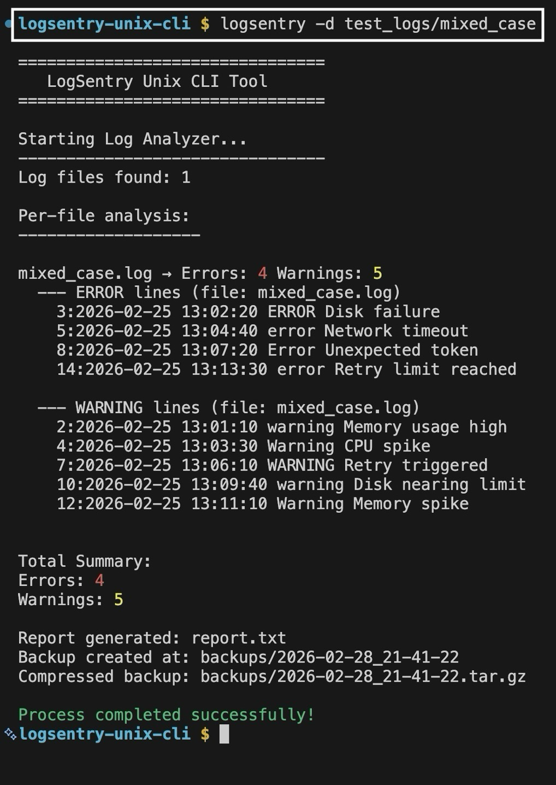
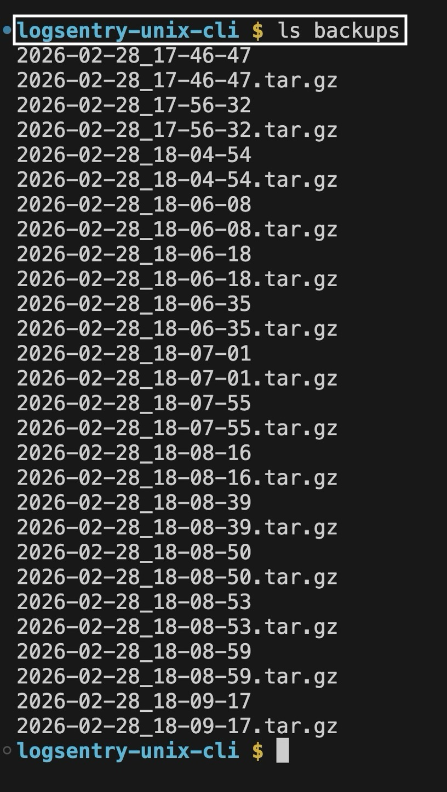
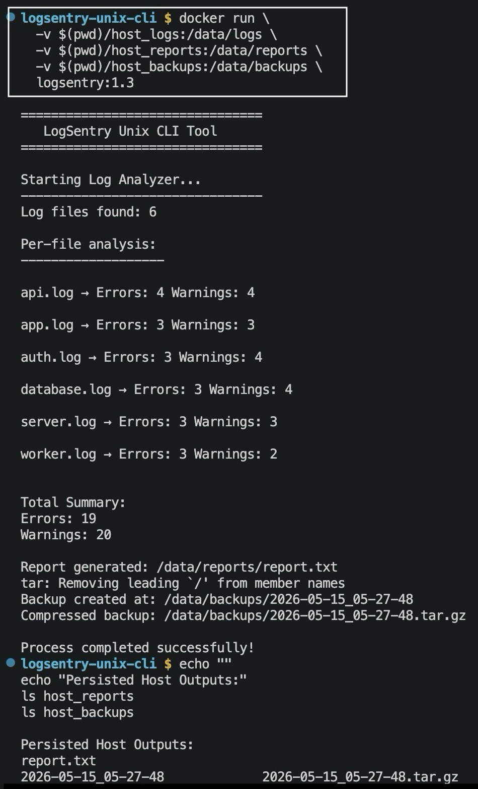
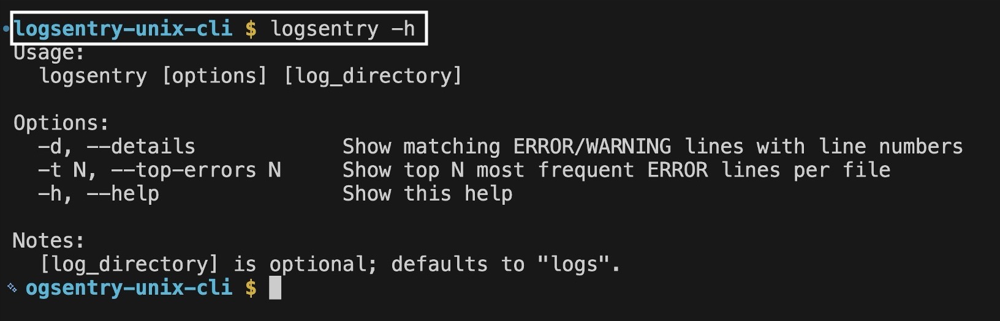

<p align="center">
  <h1 align="center">LogSentry Unix CLI</h1>
  <p align="center">
    A reusable Bash CLI for Unix log analysis, reporting, automated backups, and containerized execution.
  </p>
  <p align="center">
    <a href="https://github.com/dhananjay2403/logsentry-unix-cli/actions/workflows/ci.yml">
      
    </a>
    
    
    
  </p>
</p>

---

## Installation

```bash
chmod +x install.sh
./install.sh                        # installs to /usr/local/bin (uses sudo if needed)
PREFIX="$HOME/.local" ./install.sh  # user-local install, no sudo
```

Run from anywhere after install:

```bash
logsentry
logsentry /path/to/logs
logsentry --version
```

Remove it again with `./uninstall.sh` (pass the same `PREFIX` you installed with).

---

## Docker Usage

### Pull from Docker Hub

```bash
docker pull dhananjaytiwari/logsentry:1.3
```

---

### Build Locally

```bash
docker build -t logsentry:1.5 .
mkdir -p host_logs host_reports host_backups
cp logs/*.log host_logs/

docker run --rm --user "$(id -u):$(id -g)" \
  -v "$(pwd)/host_logs:/data/logs" \
  -v "$(pwd)/host_reports:/data/reports" \
  -v "$(pwd)/host_backups:/data/backups" \
  logsentry:1.5
```

Reports and compressed backups persist on the host through the bind mounts.

The image is Alpine-based and runs as a non-root user, so `--user "$(id -u):$(id -g)"`
keeps generated files owned by you. Alpine ships **busybox awk**, which is why the
analysis engine is written in POSIX awk — CI verifies that the container and the host
produce identical counts.

---

## Usage

```bash
logsentry                                              # analyse ./logs
logsentry tests/fixtures/realistic/microservices_sim   # analyse any directory
```

---

## Quick options

```bash
logsentry -h                                     # show help
logsentry -V                                     # show version
logsentry -d tests/fixtures/mixed_case           # show matching ERROR/WARNING lines with line numbers
logsentry -t 3 tests/fixtures/errors             # show top 3 most frequent ERROR lines per file
logsentry -r --pattern '*.log*' /var/log/myapp   # search sub-directories, include rotated logs
logsentry -q logs                                # totals only
logsentry --keep 5 logs                          # keep only the 5 newest backup archives
```

### Machine-readable output

```bash
logsentry --json logs | jq '.errors'
logsentry --json logs | jq -r '.results[] | "\(.file) \(.errors)"'
```

`--json` prints a single object — totals, the report and archive paths, and a
`results` array with per-file counts — and nothing else, so it pipes cleanly.

### Using it as a CI gate

```bash
logsentry -q --fail-on-error 10 /var/log/myapp || echo "error budget exceeded"
```

Exit codes are a CLI's API: they are what let a tool compose with `&&`, `||`, and CI.

| Code | Meaning |
|---|---|
| `0` | Analysis completed |
| `1` | Usage error, missing directory, or no matching files found |
| `2` | Errors reached the `--fail-on-error` threshold |

### Environment variables

| Variable | Default | Purpose |
|---|---|---|
| `LOG_DIR` | `logs` | Directory to analyse when no argument is given |
| `REPORT_DIR` | `reports` | Where the summary report is written |
| `BACKUP_ROOT` | `backups` | Where `.tar.gz` backup archives are written |
| `NO_COLOR` | unset | Set to any value to disable coloured output |

---

## Features

- Single-pass POSIX `awk` engine: each file is read once, whatever flags are used.
- Whole-word level matching — `ERROR`, `ERR`, `FATAL`, `CRITICAL`, `WARN`, `WARNING` are
  counted; `error_rate=0`, `ErrorHandler` and `0 errors found` are not.
- Per-file breakdown plus an aggregated summary, with `-d` for matching lines and
  `-t N` for the most frequent errors.
- `--json` output for pipelines, and `--fail-on-error N` (exit `2`) to gate CI.
- Recursive search and custom globs for nested and rotated logs (`-r`, `--pattern`).
- Report with per-file table, and timestamped `.tar.gz` archives created straight from
  the source logs under `umask 077`, with `--keep N` retention.
- Alpine Docker image (20.5 MB), non-root, with bind-mounted reports and backups.
- Graceful failures with clear messages on stderr and documented exit codes.
- Colorized output that disables itself when redirected, plus `--no-color` / `NO_COLOR`.
- Dependency-free test suite (64 assertions) with ShellCheck and Docker checks in CI.
- Runs unchanged on macOS (bash 3.2), Linux, and Alpine/busybox.

---

## Screenshots

<table>
  <tr>
    <td align="center"><b>Run Output (summary)</b></td>
    <td align="center"><b>Run Output (details: -d)</b></td>
    <td align="center"><b>Run Output (top errors: -t 3)</b></td>
  </tr>
  <tr>
    <td align="center">
      
    </td>
    <td align="center">
      
    </td>
    <td align="center">
      
    </td>
  </tr>

  <tr>
    <td align="center"><b>Generated Report</b></td>
    <td align="center"><b>Persistent Backup Artifacts</b></td>
    <td align="center"><b>Docker Runtime Persistence</b></td>
  </tr>
  <tr>
    <td align="center">
      
    </td>
    <td align="center">
      
    </td>
    <td align="center">
      
    </td>
  </tr>

  <tr>
    <td colspan="3" align="center">
      <b>Help / Flags</b>
    </td>
  </tr>
  <tr>
    <td colspan="3" align="center">
      
    </td>
  </tr>
</table>

---

## Tech Stack

- Bash (3.2-compatible)
- Unix CLI tools (`grep`, `sed`, `sort`, `uniq`, `tar`, `date`, `basename`)
- Docker
- GitHub Actions, ShellCheck
- Git

---


## Testing

```bash
./tests/test_logsentry.sh
```

The suite is plain Bash — no framework to install — and every case asserts a real
value, so it fails loudly when behaviour regresses. It writes reports and archives
to a temporary directory, never into the repository.

Fixtures live in `tests/fixtures/`:

| Fixture | Contents |
|---|---|
| `clean/` | Only INFO lines (0 errors, 0 warnings) |
| `errors/` | Two files, 5 ERROR lines total, including a repeated line for `-t` |
| `warnings/` | 3 WARNING lines |
| `mixed_case/` | `error` / `Error` / `ERROR` and `warning` / `WARNING` |
| `malformed/` | Junk and unstructured lines around 1 ERROR and 1 WARNING |
| `tricky/` | `error_rate=0`, `ErrorHandler`, `0 errors found`, `WARN`, `FATAL`, `CRITICAL` — locks whole-word level matching in |
| `nested/` | Sub-directory and a rotated `.log.1` file, for `-r` and `--pattern` |
| `empty/` | No `.log` files (graceful-failure path) |
| `realistic/` | Apache access log, JSON lines, multi-service logs, noisy log — regenerate with `./scripts/generate_demo_logs.sh` |

### What the tests validate

- Per-file and aggregate ERROR/WARNING counts, including mixed-case levels
- Whole-word level matching (`error_rate=0` not counted, `WARN` and `FATAL` counted)
- Filenames containing spaces
- `LOG_DIR`, `REPORT_DIR`, and `BACKUP_ROOT` overrides
- Exit code `1` with a clear message for a missing directory, a directory with no
  matching files, a non-numeric `-t`, and an unknown option
- Exit code `2` at the `--fail-on-error` threshold, and `0` below it
- `-d`, `-t N`, `--top-errors=N`, `-r`, `--pattern`, `--quiet`, `--no-color`,
  `--help`, and `--version` output
- `--json` field values, and that the document parses as JSON
- Report contents including the per-file table, that archives contain plain file names
  with no staging copy left behind, and that `--keep N` prunes older archives

### Continuous integration

[`.github/workflows/ci.yml`](.github/workflows/ci.yml) runs on every push and pull request:

- **ShellCheck** (`-S style`) over every script — zero findings
- **Tests** on `ubuntu-latest` and `macos-latest` (bash 5 and bash 3.2)
- **Docker** build plus a container run against the sample logs
